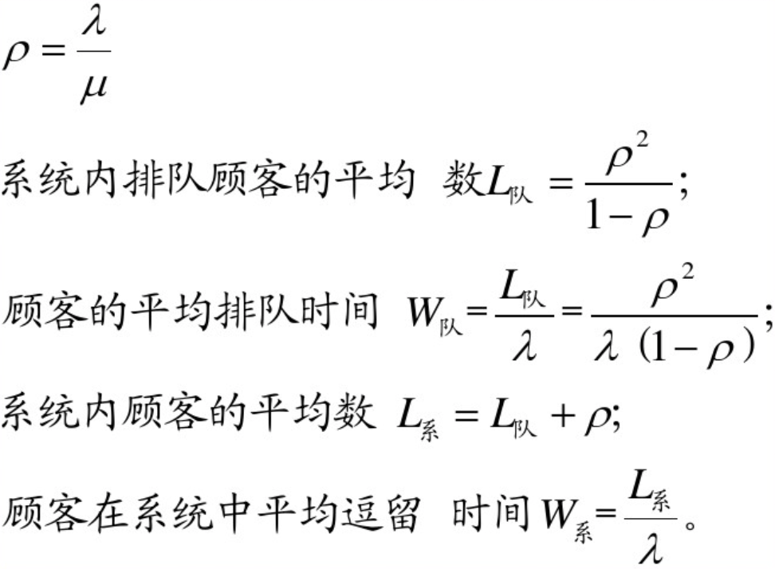

Queue Algorithm 
===============

***single Queue Analysis***

### First Method : ***Model Matching***
### Second Method : ***Neural Network***
___

Queue Model
===========

Random Arrive -> Queue -> Random Serve Time -> Leave
* ***Input Process*** 
* ***Queue Rules***
* ***Serve Process***

## ***Simplest Single SERVER Platform Model***
___

Input Process
=============
* ## ***Total Number*** : **Finite** 
* ## ***Way of Arrival*** : **Single** OR **Group**
* ## ***Time of Interval*** :  **Random**
___

Queue & Serve Rules
===================
* ## ***Queue Rule*** : **Waiting**
* ## ***Serve Rule*** : **FCFS** (First come First serve) 
___

Server Agancy
=============
* ## ***Server Platform NUM*** : 
		**Single Queue Single Platform**
* ## ***Way to Server*** : **single**
* ## ***Serve Time*** : **Random but Limited**
___
Model Classfication
===================
* ## ***X*** : **Interval Time**
* ## ***Y*** : **Arrival Time Distribution**
* ## ***Z*** : **Number of Server Platform**

# Model : X/Y/Z
(M for  Negative Exponential Distribution)
## Our Model is modelized as M/M/1
___

Possion Stream & Exponential Distribution
=========================================
* ## ***x(t)*** : **Custom NUM** 
> obeys Possion Process
> called Possion Stream & the Simplest Stream
# P(x(t)=k) = (λk)k/k!*e−λt
___

Queue System Run-time Norm：
===========================
> 绝对通过能力A：单位时间内被服务被服务顾客的数学期望
> 相对通过能力Q：被服务顾客数与请求服务顾客数的比值
> 系统损失概率P损：服务系统满员的概率
> 队长L系：系统内顾客数量的数学期望值
> 排队长L队：系统内排队顾客数的数学期望值
> 逗留时间W系：顾客在系统内逗留时间的数学期望值
> 排队时间W队：系统内顾客排队等待服务时间的数学期望
___

For single Channel Waiting Policy System
========================================

___

Model Trained By our System
===========================

